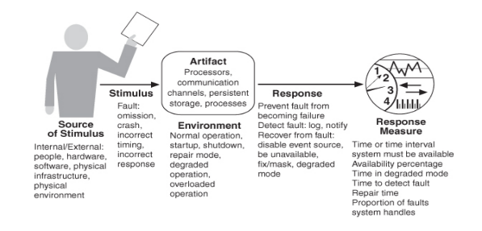

**TÓPICOS ESPECIALES EN TELEMÁTICA**

**JUAN PABLO ALCARAZ FLOREZ**

**ALEJANDRO CORDOBA BODHERT**

**CRAIG DAVID CARTAGENA CASTANO**

**PROFESOR: EDWIN MONTOYA**

**UNIVERSIDAD DE EAFIT**

**INGENIERIA DE SISTEMAS**

**2018**

1. Definición del equipo, proyecto y aplicación

a.

JUAN PABLO ALCARAZ FLOREZ(PERFORMANCE)

ALEJANDRO CORDOBA BODHERT(SEGURIDAD)

CRAIG DAVID CARTAGENA CASTANO(DISPONIBILIDAD)

b.

ALEJANDRO CORDOBA BODHERT

NOMBRE: TRACKER( [https://github.com/Bodhert/Tracker](https://github.com/Bodhert/Tracker))

c.

Este proyecto era la entrega 1 de la materia topicos especiales de ingeniería de software de la universidad de EAFIT, donde se plantea una aplicación  que localize mi posición actual y me muestre mi posición cada 5 segundos.

d.

1. Crear usuario
2. Obtener localizacion actual
3. Detener localizacion actual 

Despliegue del proyecto: Ubuntu 16.04

Framework: npm y node

Base de datos: MongoDB

Web server: Apache

Web app server: Passenger

Lenguaje de programación: Javascript

Git: CLI

3. Implementado en el proyecto

4. 

Un requisito de atributo de calidad debe ser inequívoco y comprobable, utilizamos estímulos para describir un evento que llega al sistema. la fuente del estímulo puede afectar la forma en que se trata al sistema. y también debe tomarse en cuenta la respuesta para saber cómo debe responder el sistema ante estímulos. la respuesta consiste en las responsabilidades que el sistema o los desarrolladores  deben realizar en respuesta al estímulo. un ejemplo en el escenario de rendimiento, llega un evento(estímulo) y el sistema debe procesar ese evento y generar una respuesta. después de debe determinar si es una respuesta satisfactoria, si se cumple el requisito. se habilita y esto podría ser una medida de latencia o rendimiento.

el ambiente en  el entorno de un requisito es el conjunto de circunstancias en que se produce un escenario. el ambiente actúa como un calificador en el estímulo. y el artefacto es la parte del sistema al que se aplica el requisito. frecuentemente es todo el sistema,pero ocasionalmente de partes específicas del sistema.

para especificar los atributos de calidad se dividen en 6 partes:

1. Fuente de estímulo: entidad que genera el estimulo
2. Estimulo: condición que requiere una respuesta cuando llega al sistema
3. Medio ambiente: el estímulo ocurre bajo ciertas condiciones, para estos tipos de sistema,el entorno debe especificar en qué modo se está ejecutando el sistema
4. Artefacto: colección de sistemas o partes del sistema
5. Respuesta: actividad realizada como resultado de la llegada de un estímulo
6. Medida de respuesta: cuando se produce la respuesta, debe ser medible para ser probado.

**Disponibilidad:  Ensuring High Availability For Your Enterprise Web Applications**

La alta disponibilidad es una factor esencial para las aplicaciones de misión crítica, en tiempo real y de comercio, ya que se traduce directamente en el tráfico de los ingresos y del sitio.

los principios claves de la alta disponibilidad, varían de un escenario a otro, algunas de las cualidades esenciales son:

La arquitectura HA debe satisfacer los acuerdos de nivel de servicio de disponibilidad (SLA).

• La arquitectura de alta disponibilidad debe admitir conmutación por error y recuperación, transparente para el usuario final sin pérdida de datos.

• La arquitectura HA debe incluir una estrategia de monitoreo proactiva para permitir la autodetección y la autocorrección.

• La arquitectura HA debe proporcionar una estrategia integral para el manejo del tiempo de inactividad planificado y no planificado.

• La arquitectura HA debe comprender estrategias para manejar todos los posibles puntos de falla. entre otros.

las motivaciones para la alta disponibilidad están relacionadas con el negocio, alta disponibilidad es sinonimo en ingresos comerciales y ventaja competitiva. algunas claves destacadas son:

Minimice cualquier pérdida debido a tiempo de inactividad e interrupciones
• Asegurar la continuidad del negocio en caso de desastre natural o circunstancias imprevistas

• Minimice la pérdida de material evitando y minimizando la pérdida de datos / información

• Mejore la satisfacción y lealtad del usuario mediante la máxima disponibilidad de funciones, procesos y servicios críticos para el negocio

• Obtener una ventaja competitiva a través de la máxima disponibilidad de software y servicios

• Cumplir con las leyes y regulaciones en dominios tales como el cuidado de la salud y aplicaciones de misión crítica

• Cumplir con los SLA de servicio prometidos a los clientes. entre otros.

la planificación de alta disponibilidad tiene ciertas características, La planificación de HA comienza con el negocio analizando los requisitos de disponibilidad para el negocio y evaluando el impacto global del tiempo de inactividad en el negocio. En esta etapa, la empresa identifica la funcionalidad del software, el proceso comercial, las transacciones y las páginas que son fundamentales para la continuidad y el éxito del negocio.
Una vez que se identifica el impacto comercial, la empresa especifica el SLA de rendimiento para la disponibilidad. Por ejemplo, un SLA de disponibilidad de 99.999% (a menudo denominado &quot;cinco nueves&quot;) se traduce en un período de tiempo máximo permitido de 5 min del sistema general por año. Las métricas específicas del negocio, como el Objetivo de tiempo de recuperación (RTO) y el Objetivo del punto de recuperación (RPO), a menudo se utilizan como base para llegar a los acuerdos de niveles de servicio (SLA) de disponibilidad.
El resultado final de la planificación empresarial resulta en la identificación de Indicadores de rendimiento clave de disponibilidad, tales como:

• Disponibilidad SLA

• Funciones, transacciones y procesos críticos para el negocio

• Copia de seguridad de datos y archivo SLA

• Límites de tiempo de inactividad tolerable. entre otros.

Los desafios de la alta disponibilidad, es imprescindible identificar todos los desafios comunes para la alta disponibilidad. pero mencionamos algunos:

 Relacionados al Hardware:

Problemas de diseño y codificación de aplicaciones: un código de software mal escrito que no es escalable o que no maneja las excepciones causará fugas de memoria / conexión y puede bloquear el servidor, lo que provocará interrupciones en la producción.

Desafíos de interfaz empresarial y ascendente: debido a la naturaleza compleja de las aplicaciones de software empresarial actuales, las funcionalidades principales de la aplicación están vinculadas a la aplicación de backend, a menudo denominada &quot;sistema de registro&quot;.

Relacionados al Proceso:

Ausencia del proceso de gobernanza de la disponibilidad: se necesita un proceso sólido de gobierno para establecer y mantener la máxima disponibilidad para la aplicación.

Ausencia del proceso de monitoreo y notificación: es crítico para una arquitectura de alta disponibilidad contar con un sistema de monitoreo continuo y en tiempo real, respaldado por un equipo de operaciones y mantenimiento de 24 horas. y entro muchos otros que se deben tener en cuenta.

Patrones de arquitectura de alta disponibilidad y mejores prácticas. estos están basadas en técnicas de instancias del mundo real. algunos de los patrones que mencionaremos son disenos para abordar desafíos:

Failover: durante escenarios de carga pesada, la capacidad del sistema para operar en caso de falla de un nodo o componente al cambiar transparentemente a otro componente de respaldo a menudo se conoce como failover.

Failback: ocurre después del failover, donde el nodo primario o el sitio primario se recupera de la falla y estará completamente operativo.

otros patrones son: Replication, Redundancy, Virtualization...

**Seguridad: Securing Enterprise Web Application**

La seguridad de las aplicaciones empresariales abarca una amplia gama de preocupaciones, como la protección de datos confidenciales, la prevención de ataques externos e internos, la adopción de estándares de cifrado adecuados y la aplicación de las mejores prácticas de seguridad en los componentes de hardware y software, entre otros. La seguridad tiene un impacto directo en los tres atributos de calidad n tipo grave de ataque de seguridad como la denegación de servicio distribuida ralentizará el rendimiento de la aplicación y puede generar problemas de disponibilidad. Otros impactos adversos de los incidentes de seguridad incluyen la pérdida de material, la erosión de la base de clientes y la lealtad, el compromiso de la propiedad intelectual y otros. Del mismo modo, la seguridad es de suma importancia para la disponibilidad y el rendimiento de la aplicación.

Estrategia de seguridad debe abordar algunos de los aspectos que vamos a mencionar:

Confidencialidad: los datos no deben divulgarse a usuarios no autorizados o sin intención.

Integridad: los datos no deben ser modificados involuntariamente por usuarios no autorizados.

Disponibilidad: los datos y servicios deben estar en funcionamiento todo el tiempo.

Análisis de seguridad: el primer paso en seguridad es comprender todos los requisitos de seguridad aplicables en la fase de &quot;análisis de seguridad&quot;.

Modelado de amenazas: todas las amenazas internas y externas serán analizadas durante esta fase. Los principales riesgos y amenazas para la aplicación y el sistema empresarial se identifican y modelan. entre otros.

Vulnerabilidad, amenaza y evaluacion de riesgos. aqui se debe evaluar las amenazas y vulnerabilidad para la aplicacion y los sistemas empresariales. en esta fase se compila y se evaluan las vulnerabilidades conocidas en los sistemas utilizados en la arquitectura.

Vulnerabilidad: una vulnerabilidad o defecto inherente en el sistema o aplicación, que permite que ocurran los incidentes de seguridad, se conoce como vulnerabilidad.

Amenaza: la fuente clave o el agente responsable del incidente de seguridad se identifica como una amenaza.

Riesgo: la probabilidad de que se produzcan ataques de seguridad se conoce como riesgo.

Disenar principios y politicas de seguridad, Las políticas deben ser exhaustivas y estar bien definidas para abordar los pasos específicos que deben implementarse, los roles y las responsabilidades, la capa en la que se debe implementar el control y otros detalles más exactos.Además de la política de control de seguridad para abordar las amenazas identificadas, los arquitectos de seguridad de la empresa y los arquitectos de seguridad de la información también establecerán los principios de seguridad. Estos principios de seguridad proporcionan un amplio conjunto de pautas de arquitectura, que deben cumplirse durante la arquitectura de la aplicación empresarial y al diseñar la infraestructura.

Implementación de la política de seguridad en todos los niveles. En esta fase, implementaremos las políticas de control de seguridad. Para proporcionar defensa en profundidad, necesitamos implementar controles de seguridad apropiados en todas las capas dentro de los componentes de hardware y software.

-Input validation policy

-Authentication and authorization policy

-Security policies for injection attacks

-Security policies to prevent XSS

-Security controls related to auditing, logging, and exception handling…

Pruebas de seguridad y monitoreo, Probar la seguridad integral de la aplicación es un aspecto crítico del proceso de prueba. Una violación de seguridad puede comprometer potencialmente la propiedad intelectual de la organización y sus datos de clientes, y la violación puede afectar gravemente la disponibilidad de la aplicación.

-Comprobaciones de autenticación, que prueban las políticas de autenticación del usuario, como la intensidad de la contraseña, el proceso de cambio de contraseña y el proceso de registro y las funciones de administración de contraseñas.

-Las verificaciones de control de acceso verifican las funciones de seguridad o autorización detalladas, como el acceso basado en roles a las funcionalidades, los derechos de acceso de los usuarios y la compartimentación de la funcionalidad.

-Las comprobaciones de fugas de información prueban varios mensajes de error y mensajes de registro de fugas accidentales de información confidencial. También se probará el almacenamiento de datos confidenciales y métodos de encriptación…

