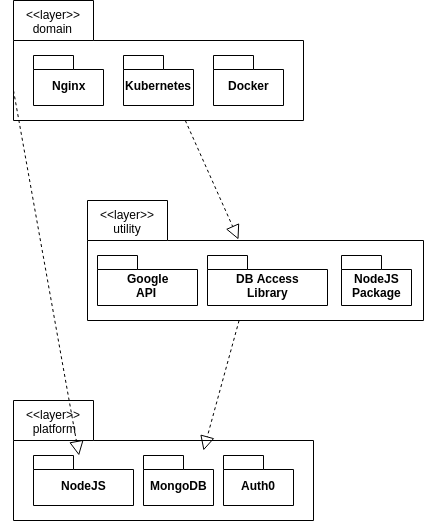
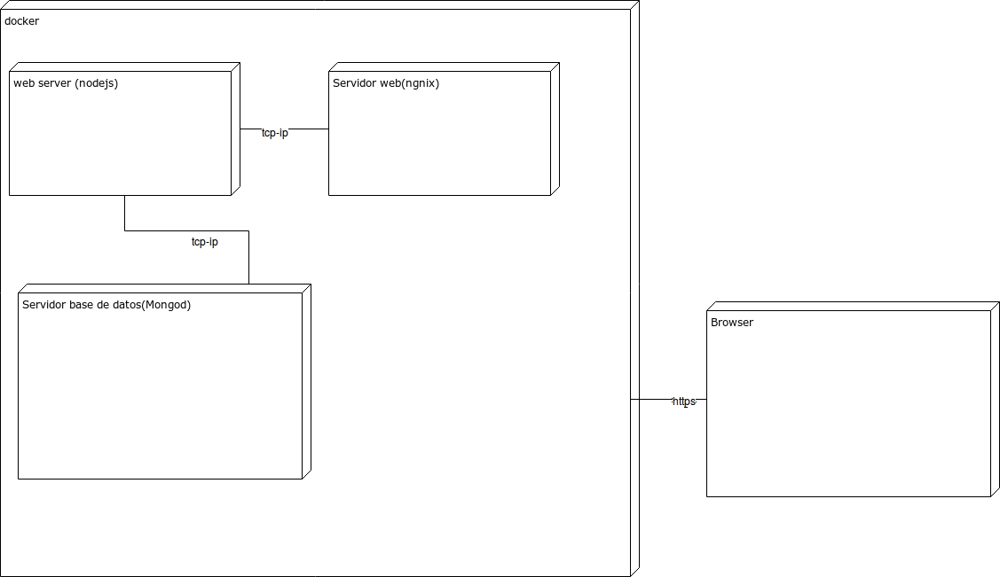
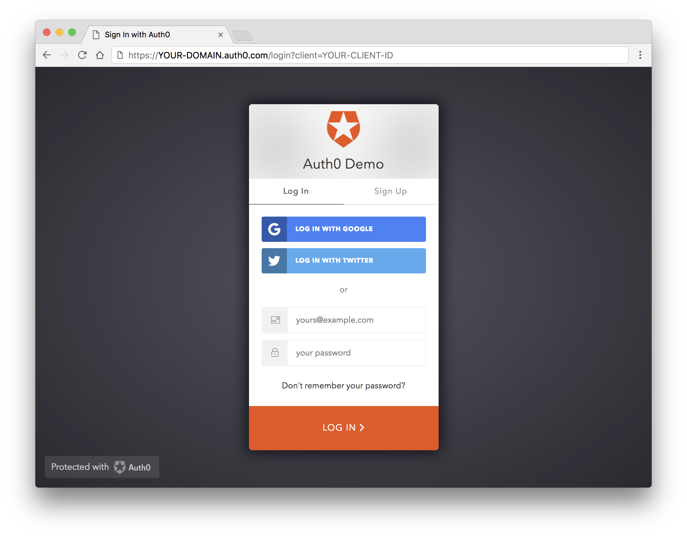
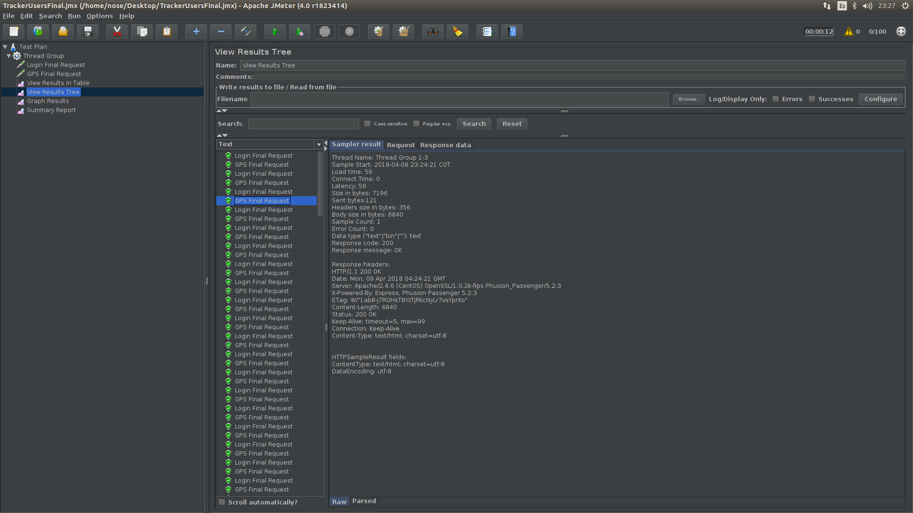
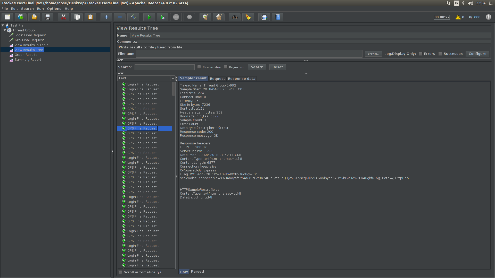

**TÓPICOS ESPECIALES EN TELEMÁTICA**

**JUAN PABLO ALCARAZ FLOREZ**

**ALEJANDRO CORDOBA BODHERT**

**CRAIG DAVID CARTAGENA CASTANO**

**PROFESOR: EDWIN MONTOYA**

**UNIVERSIDAD DE EAFIT**

**INGENIERIA DE SISTEMAS**

**2018**


[I'm an inline-style link](https://www.google.com)

2. Diseño de arquitectura

    a) Vistas de desarrollo

        i) Definición de Tecnología de Desarrollo

            Node: es un entorno de ejecución para JavaScript construido con el motor de JavaScript V8 de Chrome. Node.js usa un modelo de operaciones E/S sin bloqueo y orientado a eventos, que lo hace liviano y eficiente. El ecosistema de paquetes de Node.js, npm, es el ecosistema mas grande de librerías de código abierto en el mundo.

            Docker:  herramienta open-source que nos permite realizar una ‘virtualización ligera’, con la que poder empaquetar entornos y aplicaciones que posteriormente podremos desplegar en cualquier sistema que disponga de esta tecnología. 

            Mongo: Es una base de datos ágil que permite a los esquemas cambiar rápidamente cuando las aplicaciones evolucionan, proporcionando siempre la funcionalidad que los desarrolladores esperan de las bases de datos tradicionales, tales como índices secundarios, un lenguaje completo de búsquedas y consistencia estricta.

    ii) [Github](https://github.com/Bodhert/Tracker)

    a) Vista de software

    

    b) Vista de despliegue

        i) 

            • Servidores: 3 servidores  intel ceon e5 2650 v4 , 2.2ghz

            • un core 

            • 30 mg cache l3

            • 30 mg cache l2

            • 256 k disco

            • 18 g disco duro 

            • 2g memoria ram

            • CentOs 7





ii) [url privada ](http://10.131.137.154:3000   )


3. 

Seguridad

• single sign on con auth0, es decir ya no se manejan los usuarios si no que mediante una api segura se guardan los usuarios.


Instrucciones

Instalar las dependencias del middleware
```
npm install passport passport-auth0 connect-ensure-login --save
```

Luego , se importan las dependencias necesarias en la instancia principal de la aplicacion , todas las  `variables terminadas en AUTH0`  reemplazarlas por las credenciales que te brinde
[AUTH0](https://auth0.com/)
```javascript

// app.js

const passport = require('passport');
const Auth0Strategy = require('passport-auth0');

// Configure Passport to use Auth0
const strategy = new Auth0Strategy(
  {
    domain: 'DOMINIO_AUTH0',
    clientID: 'ID_CLIENTE_AUTH0',
    clientSecret: 'CLIENT_SECRET_AUTH0',
    callbackURL: 'http://localhost:3000/callback' // si es local , si no a la pagina que desee redireccionar
  },
  (accessToken, refreshToken, extraParams, profile, done) => {
    return done(null, profile);
  }
);

passport.use(strategy);

// This can be used to keep a smaller payload
passport.serializeUser(function(user, done) {
  done(null, user);
});

passport.deserializeUser(function(user, done) {
  done(null, user);
});

// ...
app.use(passport.initialize());
app.use(passport.session());
```

Deberia salirte algo como esto 



Luego donde manejas tus rutas añade el siguiente codigo

```javascript
router.get(
  '/login',
  passport.authenticate('auth0', {
    clientID: env.AUTH0_CLIENT_ID,
    domain: env.AUTH0_DOMAIN,
    redirectUri: env.AUTH0_CALLBACK_URL,
    audience: 'https://' + env.AUTH0_DOMAIN + '/userinfo',
    responseType: 'code',
    scope: 'openid profile'
  }),
  function(req, res) {
    res.redirect('/');
  }
);
```
Ahora en donde manejes los usuarios copia el siguiente segmento
```javascript
router.get('/', ensureLoggedIn, function(req, res, next) {
  res.render('user', {  // a esta pagina mandas la informacion del usurio, ya depende de ti 
    user: req.user,     //como tengas organizado las vistas
    userProfile: JSON.stringify(req.user, null, '  ')
  });
});
```
• certificado local https.
 
 Antes de hacer esto debemos aseguranos de tener Nginx en Nuestra CentoOs 7

 Primero añadimos los paquetes
 ```
 $sudo yum install epel-release
 ```


Instalamos nginx
```
 $sudo yum install nginx
 ```

Verificamos que el servicio este corriendo 
 ```
systemctl status nginx

● nginx.service - The nginx HTTP and reverse proxy server
   Loaded: loaded (/usr/lib/systemd/system/nginx.service; disabled; vendor preset: disabled)
   Active: active (running) since Fri 2017-01-06 17:27:50 UTC; 28s ago

. . .

Jan 06 17:27:50 centos-512mb-nyc3-01 systemd[1]: Started The nginx HTTP and reverse proxy server.

 ```

 Queremos que el servicio inicie cuando prendamos la maquina
 ```
 $ sudo systemctl enable nginx
  Created symlink from /etc/systemd/system/multi-user.target.wants/nginx.service to /usr/lib/systemd/system/nginx.service.
 ```

 Si tenemos el firewall corriendo desactivemoslo
 ```
    $sudo firewall-cmd --add-service=http
    $sudo firewall-cmd --add-service=https
    $sudo firewall-cmd --runtime-to-permanent

 ```

 Si tienes firewall the tablas ip, añade http, https con los siguientes comandos
 ```
    $sudo iptables -I INPUT -p tcp -m tcp --dport 80 -j ACCEPT
    $sudo iptables -I INPUT -p tcp -m tcp --dport 443 -j ACCEPT
 ```

 luego creamos el certificado SSL

 Creamos las Carpetas dodne guardaremos los certificados que generaremos

```
 sudo mkdir /etc/ssl/private
 sudo chmod 700 /etc/ssl/private
```

ahora creamos un certificado auto-firmado con OpenSSL, y los guardamos en la carpeta previamente creada con el siguiente comando
```
$sudo openssl req -x509 -nodes -days 365 -newkey rsa:2048 -keyout /etc/ssl/private/nginx-selfsigned.key -out /etc/ssl/certs/nginx-selfsigned.crt
```

Saldra una tabla donde nos pedira la siguiente informacion:
`Common Name` es de suprema importancia debido a que es la ip donde esta alojada la aplicación
```
Country Name (2 letter code) [AU]:CO
State or Province Name (full name) [Some-State]:Antioquia
Locality Name (eg, city) []:Medellin
Organization Name (eg, company) [Internet Widgits Pty Ltd]:Telematica
Organizational Unit Name (eg, section) []:Proyecto 2
Common Name (e.g. server FQDN or YOUR name) []:server_IP_address
Email Address []:admin@your_domain.com
```

para garanizar una comunicacion segura con los clientes corremos es siguiente comando:
```
sudo openssl dhparam -out /etc/ssl/certs/dhparam.pem 2048
```

Ahora configuramos Nginx para que use SSL, en dodne tenemos la configuracion de la aplicacion corriendo
```
$sudo emacs /etc/nginx/conf.d/Tracker.conf
```
añadimos las siguientes directivas
```
server {
    listen 443 http2 ssl;
    listen [::]:443 http2 ssl;

    server_name server_IP_address;

    ssl_certificate /etc/ssl/certs/nginx-selfsigned.crt;
    ssl_certificate_key /etc/ssl/private/nginx-selfsigned.key;
    ssl_dhparam /etc/ssl/certs/dhparam.pem;

    // configuracio propia de la aplicacion
    location / {
        proxy_pass http://localhost:3000;
        proxy_http_version 1.1;
        proxy_set_header Upgrade $http_upgrade;
        proxy_set_header Connection 'upgrade';
        proxy_set_header Host $host;
        proxy_cache_bypass $http_upgrade;
    }

}

```

Probamos que todo este bien con el siguiente comando
```
$sudo nginx -t
```
si algo nos sale mal , nos dira en que parte nos equivocamos, comunmente es un error de sintaxis
si no,  saldra el siguiente mensaje

```
nginx: [warn] "ssl_stapling" ignored, issuer certificate not found
nginx: the configuration file /etc/nginx/nginx.conf syntax is ok
nginx: configuration file /etc/nginx/nginx.conf test is successful
```

Reseteamos el servicio
```
sudo systemctl restart nginx
```

Ahora deberiamos poder acceder por 
```
https://server_domain_or_IP
```

como es un certificado auto firmado , el navegador no lo reconoce como seguro , ya que debe de estar firmado por algun provedor autorizado como [lets encript](https://letsencrypt.org/),pero no es problema, podemos proceder con los siguientes pasos.


Rendimiento

• Se realizaron pruebas con JMeter a la aplicación antes de ser modificada y sin los atributos de calidad especificados, así como a la aplicación una vez implementados cada uno de los QAs. De esta manera se muestra el tiempo de respuesta y cantidad de peticiones por segundo realizados sobre las paginas a cargar por medio de la aplicación.

En la siguiente imagen se puede apreciar el Throughput resultante sobre las pruebas realizadas sobre el Login y la pagina encargada de la interacción con el Mapa, así mismo se puede observar el porcentaje de error, la cantidad de Bytes enviados y recibidos, junto con algunos otros detalles.


Los resultados que se visualizan sobre la prueba de la aplicación una vez realizados las modificaciones respecto a los QAs, evidencian un aumento en el Throughput de la aplicación, lo cual puede parecer una disminución en el rendimiento, mas sin embargo se mantiene no muy por encima del observado en la imagen anterior aún sabiendo que hubo un aumento en la cantidad de Bytes enviados y recibidos, sobre todo en el Login para el cual se hace uso de un tercero encargado de permitir el Log In desde Facebook y Google.


Como se puede apreciar en la siguiente imagen la cual muestra el resultado de una prueba realizada sobre la aplicación vieja, ésta muestra la Latencia, el tiempo de conexión, los Bytes transmitidos junto con otros datos. 


La siguiente prueba se realizó sobre la aplicación resultante, en donde se puede avidenciar un aumento en la cantidad de peticiones que se realizaron, siendo ésta de 4000, sabiendo ésto se puede evidenciar que la Latencia resultante se mantuvo no muy por encima de la aplicación original, aunque hubieron alguno casos particulares para los cuales hubo un aumento en la Latencia y en pocos casos algunas peticiones con errores, mas sin embargo ésto se debió al aumento en la cantidad de información transmitida, los niveles de segúridad añadidos junto con el uso de aplicaciones de terceros para complementar los QAs.


Información correspondiente a una petición realizada sobre la pagina encargada de la interacción con el mapa, sobre un test de 100 peticiones en 10 segundos.



Información correspondiente a una petición realizada sobre la pagina encargada de la interacción con el mapa, sobre un test de 1000 peticiones en 20 segundos en la nueva aplicación.



• Para el mejoramiento de la capacidad de carga del sistema o de transacciones por segundo se realizó modificaciones sobre la forma como se guardan los datos de las ubicaciones, de tal manera que no guarde información innecesaria como lo sería de la repetición de una ubicación ya guardada previamente.

• Se realizaron las respectivas modificaciones sobre el fichero de configuración de Nginx para permitir el uso de la última actualización del protocolo de transferencia de hipertexto de red utilizado por la World Wide Web denominado HTTP/2, en donde predomina el uso de una única conexión para ofrecer multiples solicitudes y respuestas en paralelo, aún sabiendo que una pagina Web puede contener objetos HTML, CSS, JavaScript, Imágenes, Vídeo, etc..
Ademas realizá la eliminación de información redundante, avitando así el envío de datos repetidos durante una misma conexión con mejoras significativas en la latencia, y hace priorización de flujos en donde es fundamental el orden y el retardo con el que las tramas del mensaje HTTP llegan a su destino, mejorando los tiempos de espera y procesamiento.


Disponibilidad


• Balanceador de cargas con ngnx

• Disponibilidad de las bases de datos.


